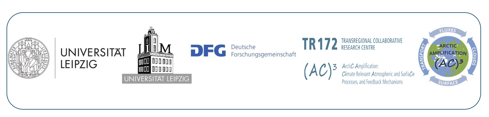

.. storypy documentation master file

Welcome to storypy's documentation!
===================================

**storypy** is an advanced toolkit that facilitates analyzing dynamical storylines by providing efficient and user-friendly tools that is flexible and adaptable for various storyline research and policy applications.

It implements the dynamical storyline framework, presented in `Zappa & Shepherd, 2017 <https://journals.ametsoc.org/doi/10.1175/JCLI-D-16-0807.1>`_, using CMIP model output. It provides:

- A set of functions to analyze multi‐model ensembles, focusing on the identification of dynamical storylines.
- Customizable options for selecting remote drivers, target seasons, and climate variables or climatic‐impact drivers.
- Flexibility and adaptability for various research and policy applications.

It supports the full analysis pipeline:

- **Preprocessing** - ESMValTool-based (Option A) and local NetCDF-based (Option B) ingestion of CMIP data
- **Driver computation** - identification of remote dynamical drivers (e.g. Tropical warming, Stratospheric polar vortex, SST in Niño3.4) from SST and circulation indices
- **Stippling** - signal-to-noise significance testing (γ criterion) via piControl simulations and model agreement testing (β criterion)
- **Regression** - multiple linear regression of target climate change onto driver indices
- **Storyline evaluation** - construction and visualization of physically-motivated climate storylines

How to cite:
------------

Alawode, R., Mindlin, J., Kretschmer, M., *et al.* (2024).  
*storypy: A Python interface for climate storyline computation.*

---

Getting Started
===============

These pages will help you install and use **storypy** for the first time.

.. toctree::
   :maxdepth: 1
   :caption: Getting Started

   getting_started/overview
   getting_started/installing
   getting_started/picontrol_recipe

---

Tutorials
=========

Below are example workflows that demonstrate how to use **storypy** in practice. Each notebook is hosted on **nbviewer** and linked directly:

- `Ghosh and Shepherd 2023 <https://nbviewer.org/github/LIM-Climate-Causality/storypy/blob/main/notebooks/sp_ghosh_2023.ipynb>`_
- `Mindlin et al. 2020 <https://nbviewer.org/github/LIM-Climate-Causality/storypy/blob/main/notebooks/sp_mindlin_2020.ipynb>`_
- `Monerie et al. 2023 <https://nbviewer.org/github/LIM-Climate-Causality/storypy/blob/main/notebooks/sp_monerie_2023.ipynb>`_
- `Zappa and Shepherd 2017 <https://nbviewer.org/github/LIM-Climate-Causality/storypy/blob/main/notebooks/sp_zs_2017.ipynb>`_

---

API Reference
=============

This section provides the technical documentation for **storypy**, including all modules, methods, and functions.

.. toctree::
   :maxdepth: 2
   :caption: API Reference

   reference/preprocess
   reference/compute
   reference/evaluate
   reference/data
   reference/utils

---

License
=======

**storypy** is available under the open source `MIT License`__.

__ https://github.com/LIM-Climate-Causality/storypy/blob/main/LICENSE

---

Acknowledgements
================

The development of this package was supported by the **Leipzig Institute for Meteorology (LIM)**,  
with partnership funding from the **Deutsche Forschungsgemeinschaft (DFG)** under AC3.

